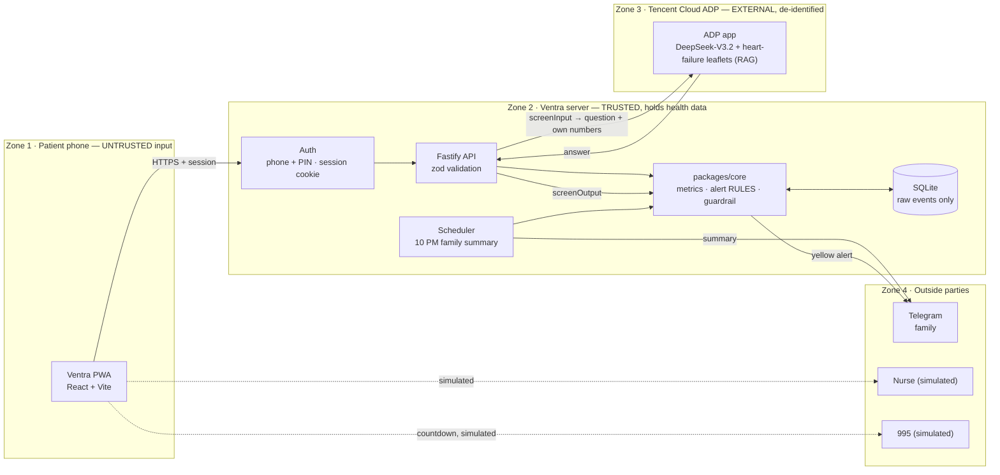

# Ventra — Heart Failure Self-Care Agent

> Safe, simple heart failure self-care companion.

**Live demo:** https://ventra-hackathon.onrender.com — tap **Log in as demo patient** (Mdm Tan · 81234567 · PIN 1234)
**Challenge:** Tencent Cloud "AI CAN DO IT" Hackathon Singapore 2026 · Challenge 2: AI Healthier Every Day
**Video:** _add link_

> ⚠️ Prototype, not a medical device. All demo data is synthetic. No real 995 or nurse calls are made. The free host sleeps when idle: the first visit can take about a minute.

---

## The problem

After a hospital stay for heart failure, the weeks at home are where things go wrong: extra fluid builds up quietly, a water pill is skipped on a day out, a salty lunch adds up. By the time someone feels breathless, it is often a readmission.

- Singapore's heart-failure readmissions compare poorly with OECD peers, according to the Ministry of Health's Agency for Care Effectiveness ([ACE, G-I-N 2025](https://isomer-user-content.by.gov.sg/68/3edc195a-ee82-4033-8e5e-f320f9d4c123/ETPO016_2025_chfavbc.pdf)).
- At the National Heart Centre Singapore, personalised education, navigator follow-up calls and a heart-failure app cut 30-day readmissions from 8.3% to 3.5% ([CHI Learning & Development](https://child.chi.sg/learn/child-collection/projects/to-reduce-the-readmission-rate-of-heart-failure-patients/)).
- Patients who actually recorded their weight on at least 80% of days had far fewer heart-failure hospitalisations (IRR 0.37) than those who did not ([PubMed 27818309](https://www.pubmed.ncbi.nlm.nih.gov/27818309/)).

Self-care works when it is easy, every day, for an older patient — and when someone notices early.

## What Ventra does

| | |
|---|---|
| **Home** | Green or yellow status for today, decided by fixed rules; 9 big tiles; a daily encouragement note |
| **Drinks** | Animated bottle against the patient's own limit; one tap per thermos cap; undo |
| **Meals** | Salt bowl against the daily limit; common Singapore meals with estimated sodium; tips |
| **Weight** | Big keypad; chart since discharge; warns on a 2 kg jump |
| **Medicine** | Today's pills with pictures; "I took it" → check → **locked** (no undo, no false adherence) |
| **How I feel** | Swollen ankles, breathlessness, dizziness, tiredness — they feed the alert rules |
| **Ask AI** | Plain-English answers from Tencent Cloud ADP, using the patient's own numbers. Emergencies get "Please call 995 now", dose questions get a fixed refusal and a nurse card |
| **Yellow alert** | Reasons in plain words, a script to read to the nurse (built from the logs), simulated nurse call |
| **Family** | Alerts reach a family member on Telegram within seconds; daily 10 PM summary; the patient chooses what else to share |
| **SOS** | On every screen: what's happening → 10-second countdown with a big Cancel → simulated call, family messaged |
| **Doctor report** | One-page A4 summary (print / Save as PDF) with the same numbers as the app |
| **Sign-up** | Phone + 4-digit PIN, then text size, clinic targets, medicines, cap size, family contact |

## Architecture



More detail: [docs/architecture.md](docs/architecture.md) · API contract: [docs/api.md](docs/api.md)

### Trust boundaries

| Boundary | Data | Protection |
|---|---|---|
| Phone → server | Logs, questions | HTTPS; every request validated with zod; every write re-runs the rules |
| Server → ADP | The question, plus the patient's own numbers for today (drink limit and intake, salt, weight, dry weight, cap size). Pseudonymous `visitor_biz_id` (HMAC) | `screenInput` first: emergency and dose questions never reach the AI. Never sent: name, phone, patient ID, medicines, dose times |
| ADP → server | Free text | Never trusted: `screenOutput` blocks dose/timing advice, leaked source wording and over-long answers; fixed fallback line |
| Rules → status | Green / yellow | Deterministic code with unit tests — never an LLM |
| Patient ↔ patient | Everything | Every query filtered by the session's `patient_id`; tests prove patient B cannot read patient A |
| Server → Telegram | Alert reasons, daily summary, SOS | Family links with a one-time code; webhook checks a secret header; alerts/status/medicines always shared, the rest is the patient's choice |

### Design trade-offs

| Decision | Chosen | Over | Why |
|---|---|---|---|
| Who decides alerts | Fixed rules in code | LLM judgement | Safety, testable, explainable to nurses |
| Safety enforcement | Code guardrail + prompt | Prompt only | We saw the model ignore fixed-line rules; code is deterministic |
| Chat model | DeepSeek-V3.2 | Hy3 | Hy3 answers were slower and longer; older patients need short, fast replies (DeepSeek ≈ 3 s) |
| Taken doses | Confirmed, then locked | Auto-taken / undo | A dose counts only when confirmed; an unconfirmed dose is "missed" 2 h after its time. No false adherence |
| AI context | Patient's own numbers, no medicines | Question only | "How much can I drink?" needs the real number; medicines are left out so the AI is never steered to dose advice |
| Database | SQLite, auto-migrate + demo rebuilt on start | Managed DB | Free hosts wipe the disk; the demo is always ready |
| App type | PWA | Native app | One live link for judges, one codebase |
| Hosting | Render (free, Singapore region) | Hugging Face Spaces / Lighthouse | Docker Spaces now need a paid plan; Render runs the same Dockerfile free |
| Meals | Manual list with estimated sodium | Photo vision | Reliable for the demo; vision is an optional extra |
| Login | Phone + 4-digit PIN | SMS code | No SMS sender approval needed; easy for older users |

## Responsible AI

- **Alerts come from tested rules** in `packages/core/src/rules.ts`, never from the AI.
- **Safety checks run in code** on every question and every answer ([guardrail.ts](packages/core/src/guardrail.ts), 77 tests). Emergencies → "Please call 995 now." Dose, skip, stop or timing questions → "I can't advise on that. Please ask your pharmacist or doctor."
- **The AI explains, it never advises on medicines.** Leaflets in the knowledge base are explanatory only.
- **Minimum data to the AI:** the question and a few of the patient's own numbers — never a name, phone number, ID or medicine list.
- **Honest when unsure:** blocked or failed answers become "I'm not able to answer that confidently. Please check with your pharmacist or doctor."
- **Locked doses:** once confirmed, a dose cannot be changed.
- **Demo honesty:** 995 and nurse calls are simulated and say so on screen.

Full write-up: [docs/safety.md](docs/safety.md) · How prompts drive the AI: [docs/prompts.md](docs/prompts.md)

## Tech stack

React 18 + Vite PWA · Fastify + zod · SQLite / Drizzle · `packages/core` (pure TypeScript, Vitest) · Tencent Cloud ADP (DeepSeek-V3.2 + knowledge base) · Telegram Bot API · Render (Docker) · built with CodeBuddy

## Run locally

Needs Node 22 and pnpm 9.

```bash
pnpm install
cp .env.example .env.local   # fill in ADP_KEY_GENERAL, TELEGRAM_* if you have them
pnpm dev                     # web http://localhost:5173 · API http://localhost:3000
pnpm test                    # core + api + web
pnpm lint
```

The API loads `.env.local` itself. Without an ADP key, Ask AI still gives the fixed safety replies; without a Telegram token, family messages are off.

**Tests:** 300+ automated tests — rules, metrics, dose model, guardrail (77), API routes incl. patient scoping and Telegram, and the screens.

## Repository

```
apps/web        React PWA (screens in src/pages)
apps/api        Fastify API, SQLite schema + migrations, ADP + Telegram clients
packages/core   metrics, alert rules, guardrail, dose model, report, family text — shared by API and web
docs/           api.md · architecture.md · safety.md · prompts.md · deploy-free.md
design/         design screens (.dc.html) used as the source of truth for the UI
evidence/       CodeBuddy screenshots and build evidence
```

## Built with CodeBuddy

CodeBuddy sessions used a rules file ([CODEBUDDY.md](CODEBUDDY.md)) and one-feature prompts. The sessions and screenshots are listed in [evidence/](evidence/README.md).

## Data sources

- Demo patient Mdm Tan and all her logs are synthetic.
- Meal sodium values are approximate estimates for a typical serving and should be confirmed by a dietitian.
- Statistics above: [ACE / Ministry of Health, 2025](https://isomer-user-content.by.gov.sg/68/3edc195a-ee82-4033-8e5e-f320f9d4c123/ETPO016_2025_chfavbc.pdf) · [NHCS readmission project, CHI](https://child.chi.sg/learn/child-collection/projects/to-reduce-the-readmission-rate-of-heart-failure-patients/) · [PubMed 27818309](https://www.pubmed.ncbi.nlm.nih.gov/27818309/)
