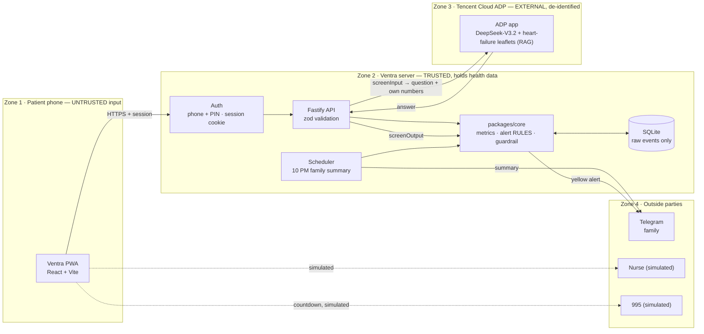

# Architecture

Ventra is one TypeScript monorepo deployed as one Docker container: a Fastify API that also serves the built React PWA.

```
apps/web        React 18 + Vite PWA, TanStack Query, React Router
apps/api        Fastify + zod, SQLite (better-sqlite3 + Drizzle), ADP and Telegram clients, 10 PM job
packages/core   Pure TypeScript shared by API and web: metrics, alert rules, dose model,
                guardrail, report, family text, AI context, food and medicine lists
```

## System and trust boundaries



GitHub renders this diagram. For slides, open it in [mermaid.live](https://mermaid.live) and export a PNG.

## One source of truth for numbers

The database stores **raw events only** (drinks, meals, weights, symptoms, dose confirmations, alerts). Every number on screen is computed by `packages/core` from those events:

- `buildMetrics(record)` → everything Home, Drinks, Meals, Weight and Medicine show (`GET /api/metrics`)
- `buildReport(record)` → the doctor report (`GET /api/report`)
- `familySummaryLines(record)` → the family preview and the Telegram summary
- `evaluate(record, date)` → green / yellow (the only place a zone is decided)

The web mock API uses the same functions on the synthetic record, so offline tests and the live app agree.

## Request flows

**Logging (drink, weight, symptom, dose):** zod validation → write a raw event scoped to the session patient → re-run `evaluate` → if today turns yellow for the first time, record an alert and message the linked family member on Telegram (fire-and-forget; the patient never waits).

**Ask AI:** session → zod → `screenInput` (emergency / dose → fixed reply, AI not called) → rate limit (8 a minute for the app) → ADP with the question plus the patient's own numbers → `screenOutput` → reply. Details in [safety.md](safety.md).

**SOS:** what's happening → 10-second countdown with Cancel → simulated call screen → `POST /api/emergency/notify` messages the family member.

## Dose model

A dose is **taken** only when the patient confirms it ("I took it"); confirmed doses are locked (no update or delete route). An unconfirmed dose becomes **missed** two hours after its time, or on any earlier day. Adherence counts only settled doses. This is what lets the "missed water pill" rule fire on the same day without false adherence.

## Time

Patients are in Singapore: every "today", time label and the 10 PM job use Asia/Singapore regardless of the server's timezone.

## Demo patient

Mdm Tan (synthetic) is rebuilt on every server start with her 11-day history shifted so her last day is today, so the demo works on any date. Demo tools (demo patient only): **Reset demo day** and **Start yellow-day demo** (today's water pill missed). Both keep the presenter logged in and keep the family's Telegram link.

## Hosting

Render free web service, Singapore region, from the repo `Dockerfile`. Free instances sleep when idle and have no persistent disk; the database is migrated and the demo rebuilt on each start. Set `TELEGRAM_BOT_TOKEN`, `TELEGRAM_WEBHOOK_SECRET` and `PUBLIC_URL` and the server registers the Telegram webhook itself. See [deploy-free.md](deploy-free.md).
